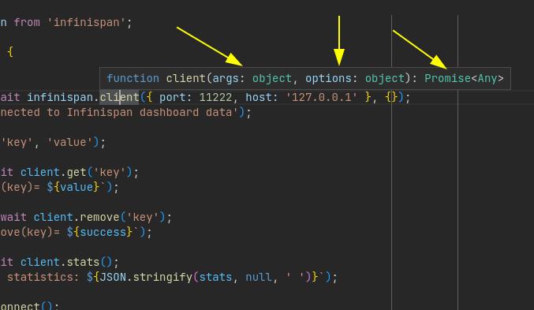
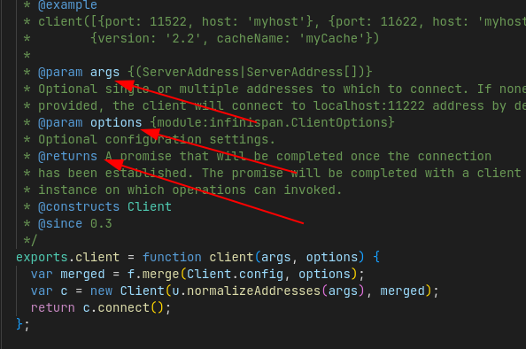
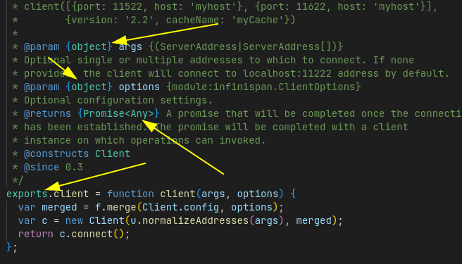

# infinispan-js-client-ts-support-test


* With TypeScript 3.7, TypeScript added support for generating .d.ts files from JavaScript using JSDoc syntax.
  * https://www.typescriptlang.org/docs/handbook/release-notes/typescript-3-7.html#--declaration-and---allowjs
  * https://www.typescriptlang.org/docs/handbook/declaration-files/dts-from-js.html

* The typescript compiler will generate `.d.ts` files based on the 
exposed / exported / external API of your JavaScript source code. 
  * https://www.typescriptlang.org/tsconfig#declaration

This command will generate (in case no errors found) all the `.d.ts` files for you:

```
npx -p typescript tsc lib/**/*.js --declaration --allowJs --emitDeclarationOnly --outDir types

```

These are the files generated by this command above:

```
├── codec.d.ts
├── functional.d.ts
├── index.d.ts      <--- I've renamed from infinispan to index.d.ts
├── io.d.ts
├── listeners.d.ts
├── protocols.d.ts
├── sasl
│   ├── bitops.d.ts
│   └── external.d.ts
└── utils.d.ts

1 directory, 9 files
```

We can also generate based in some `.js` files:

```
npx -p typescript tsc lib/infinispan.js --declaration --allowJs --emitDeclarationOnly --outDir types
```

## Result



## Before


## After



So if you write proper JSDoc and run the npx command you are going to have `.d.ts` files 
generated based on part of the current design of your library (by creating them based 
on the **exposed APIs**).

You can take a look at this JSDoc [cheat sheet ](https://docs.joshuatz.com/cheatsheets/js/jsdoc/).

[Caveats for using jsdoc to generate declaration files](https://docs.joshuatz.com/cheatsheets/js/jsdoc/#caveats-for-using-jsdoc-to-generate-declaration-files)

